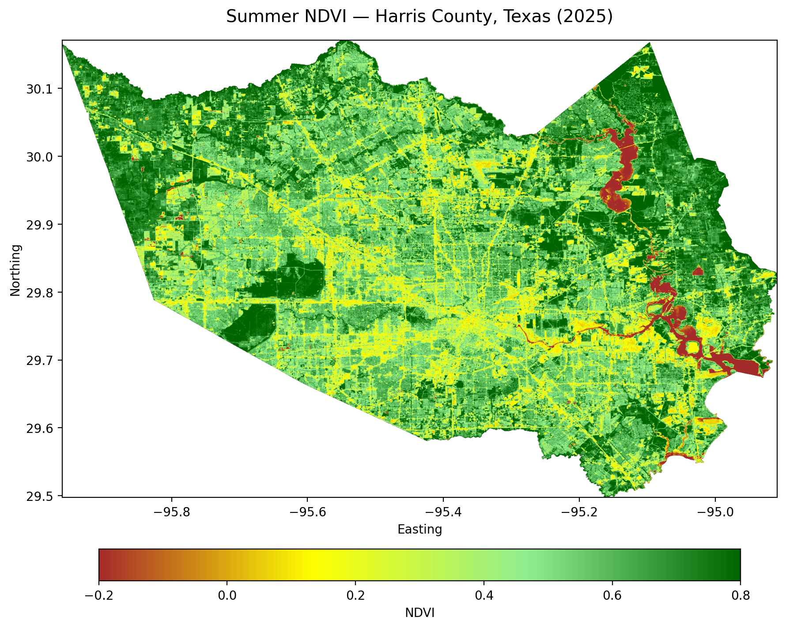
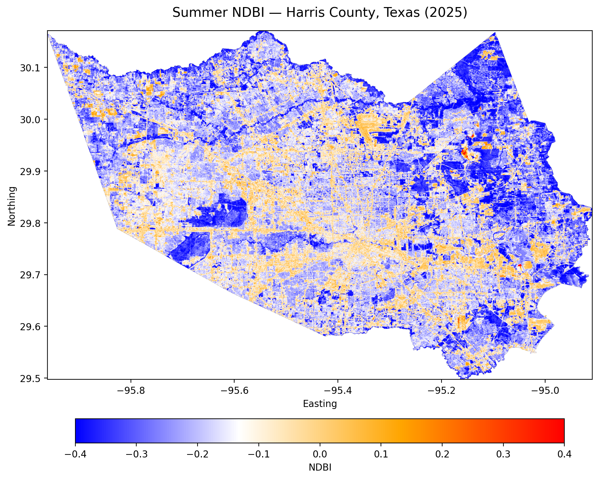
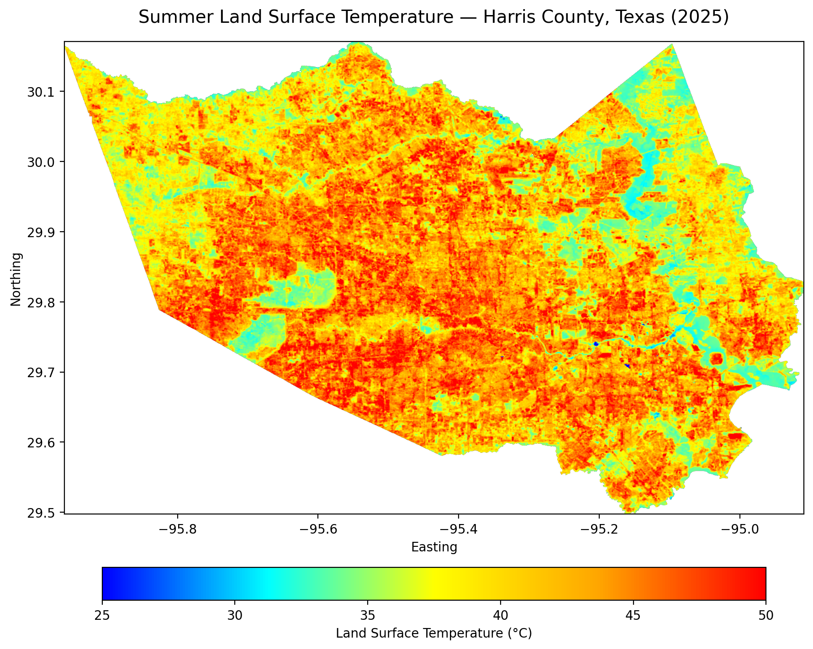
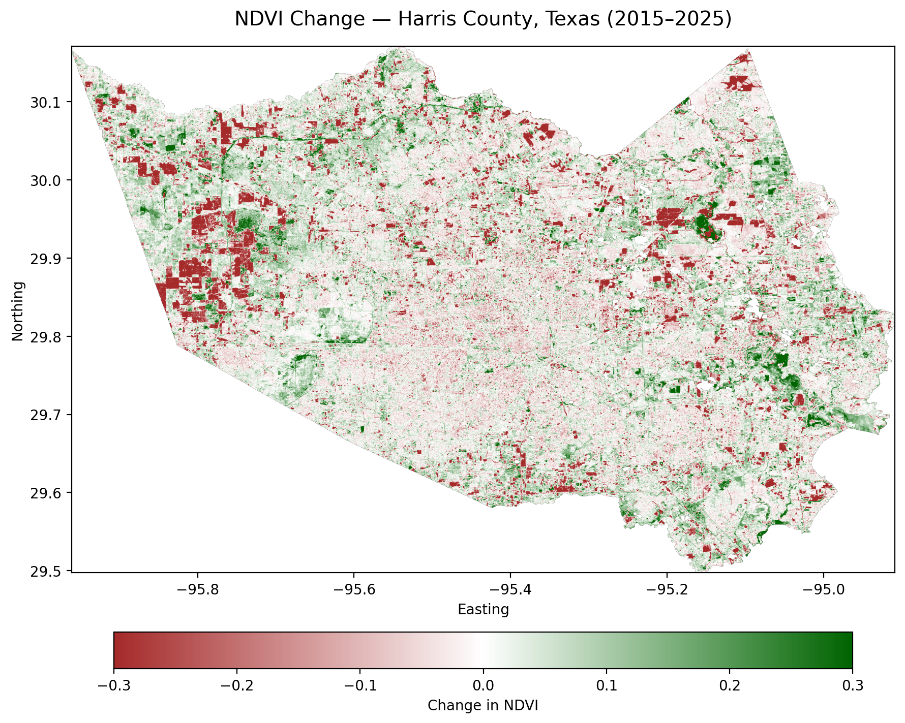
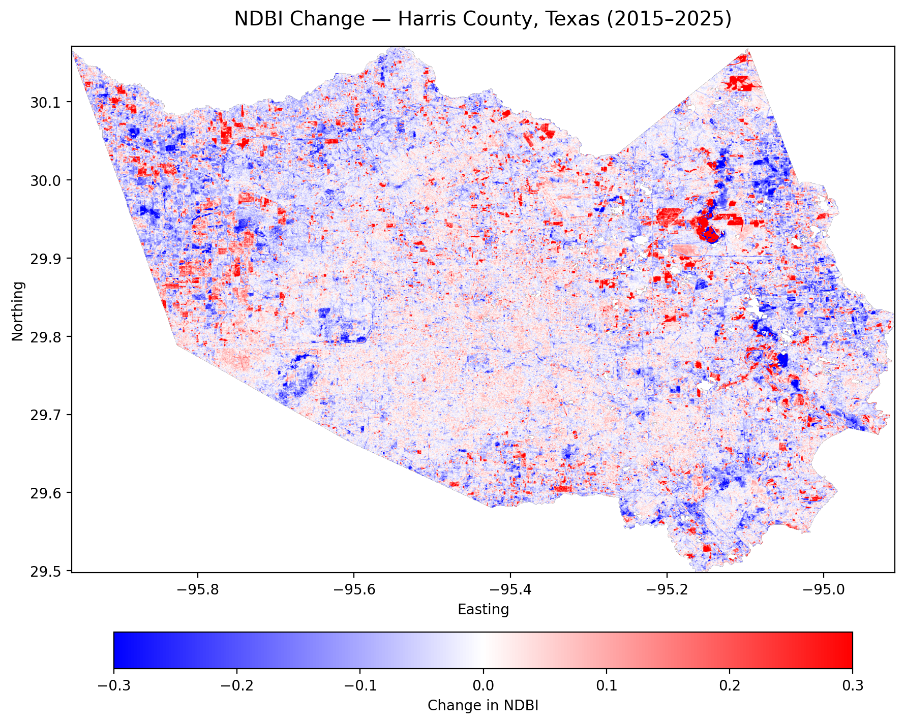
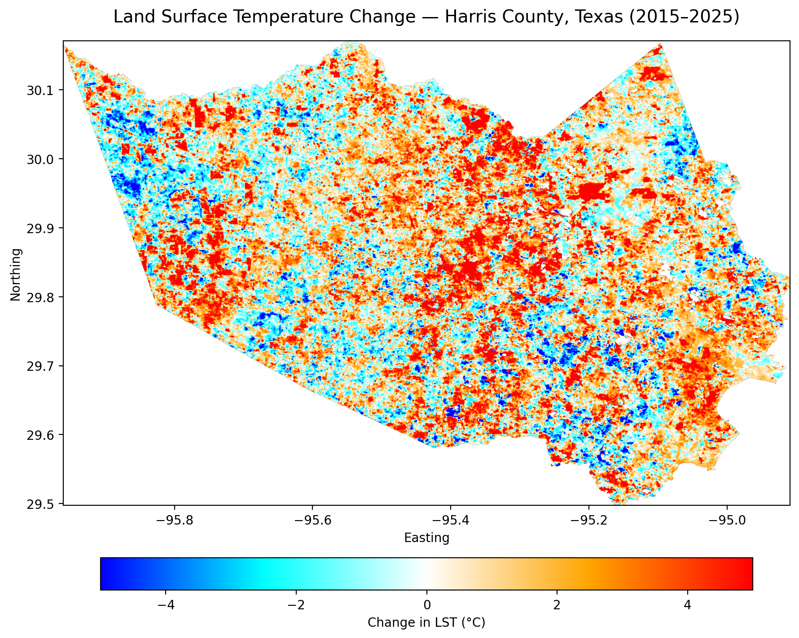

# Multi-temporal Analysis of Urban Surface Characteristics in Harris County, Texas

## Overview

This learning project uses Google Earth Engine (GEE), Python, and Landsat 8/9 imagery to examine changes in vegetation, built-up surface characteristics, and land surface temperature across Harris County, Texas, from 2015 to 2025.

## Research Question

How have vegetation cover, built-up surface characteristics, and land surface temperature changed across Harris County over the past decade?

## Data

Landsat 8 and Landsat 9 Collection 2 Level 2 imagery was used for the analysis. Summer observations from June through August were used to create annual median composites.

## Methods

The analysis includes cloud masking, Landsat scale-factor application, summer median compositing, NDVI and NDBI calculation, land surface temperature analysis, change analysis, annual time-series analysis, linear trend analysis, and correlation analysis.

## Tools

- Google Earth Engine
- Python
- geemap
- Pandas
- Matplotlib
- SciPy

## Results

### Surface Conditions in 2025

The maps below show the spatial distribution of vegetation greenness, built-up and non-vegetated surface characteristics, and land surface temperature across Harris County during summer 2025.

#### NDVI

#### NDBI

#### Land Surface Temperature

### Changes from 2015 to 2025

The following maps show spatial changes between the 2015 and 2025 summer composites. Positive and negative values represent the direction of change over the study period.

#### NDVI Change

#### NDBI Change

#### Land Surface Temperature Change

## Study Period

2015–2025

## Author

Musa Animashaun

© 2026 Musa Animashaun
